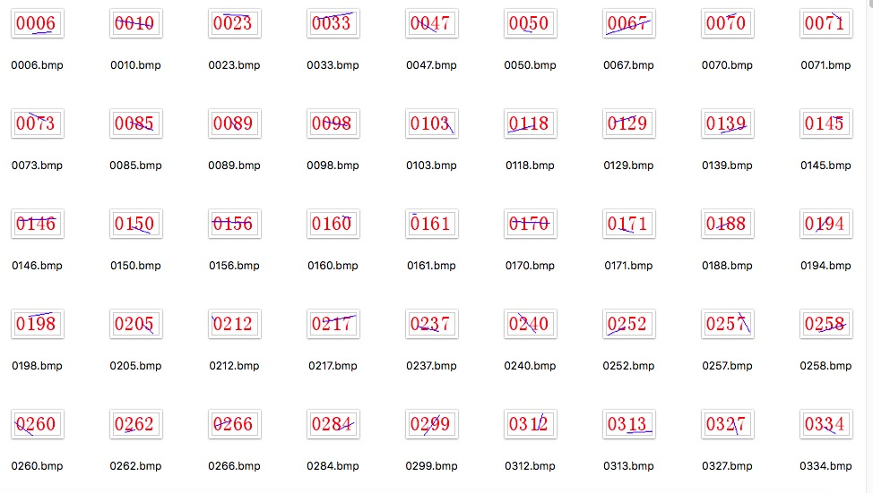
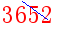
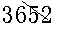
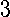
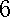
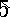
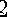
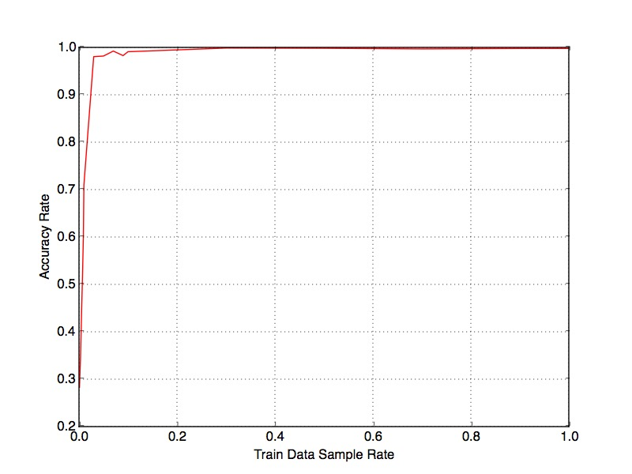

# 用svm向量机进行4位数字验证码识别

*  验证码样式




验证码：白底红字，有蓝色的干扰线

*  图片数字化和格式化

 

 


```python
def convertimg(img_path):
    # Load a color image
    image = Image.open(img_path)

    # Convert to grey level image
    imgry = image.convert('L')

    # Setup a converting table with constant threshold
    threshold = 180  # 阈值设置为180
    table = []
    for i in range(256):
        if i < threshold:
            table.append(0)
        else:
            table.append(1)

    # convert to binary image by the table
    bim = imgry.point(table,"1") # 图像二值化
    #bim.save('out.bmp')
    return bim
```

*  图片字符切割

由于字符型 验证码图片 本质就可以看着是由一系列的 单个字符图片 拼接而成，为了简化研究对象，我们也可以将这些图片分解到 原子级 ，即： 只包含单个字符的图片。

整个图片尺寸是 60*30
单个字符尺寸是 10*17
左右字符和左右边缘相距2个像素
字符上下相距6个像素

 

 

 

 

```python
height = 17
width = 10
def get_crop_imgs(img):
    # split image into four child images
    child_img_list = []
    for i in range(4):
        x = 2+i * 14
        y = 6
        child_img = img.crop((x, y, x + width, y + height))
        child_img_list.append(child_img)
    return child_img_list
```


*  模型识别

大量完成预处理并切割到原子级的图片素材准备
对素材图片进行人为分类，即：打标签
定义单张图片的识别特征
使用SVM训练模型对打了标签的特征文件进行训练，得到模型文件

*  特征选择

从宏观上看，不同的数字图片的本质就是将黑色按照一定规则填充在相应的像素点上，所以这些特征都是最后围绕像素点进行。

字符图片 宽10个像素，高17个像素 ，理论上可以最简单粗暴地可以定义出170个特征：170个像素点上面的像素值。但是显然这样高维度必然会造成过大的计算量，可以适当的降维。

每行上黑色像素的个数，可以得到10个特征
每列上黑色像素的个数，可以得到17个特征

总共27个特征

*  SVM多分类

SVM本身是一个二值分类器

　　SVM算法最初是为二值分类问题设计的，当处理多类问题时，就需要构造合适的多类分类器。

　　目前，构造SVM多类分类器的方法主要有两类

　　（1）直接法，直接在目标函数上进行修改，将多个分类面的参数求解合并到一个最优化问题中，通过求解该最优化问题“一次性”实现多类分类。这种方法看似简单，但其计算复杂度比较高，实现起来比较困难，只适合用于小型问题中；

　　（2）间接法，主要是通过组合多个二分类器来实现多分类器的构造，常见的方法有one-against-one和one-against-all两种。

一对多法（one-versus-rest,简称OVR SVMs）

　　训练时依次把某个类别的样本归为一类,其他剩余的样本归为另一类，这样k个类别的样本就构造出了k个SVM。分类时将未知样本分类为具有最大分类函数值的那类。

　　假如我有四类要划分（也就是4个Label），他们是A、B、C、D。

　　于是我在抽取训练集的时候，分别抽取

　　（1）A所对应的向量作为正集，B，C，D所对应的向量作为负集；

　　（2）B所对应的向量作为正集，A，C，D所对应的向量作为负集；

　　（3）C所对应的向量作为正集，A，B，D所对应的向量作为负集；

　　（4）D所对应的向量作为正集，A，B，C所对应的向量作为负集；

　　使用这四个训练集分别进行训练，然后的得到四个训练结果文件。

　　在测试的时候，把对应的测试向量分别利用这四个训练结果文件进行测试。

　　最后每个测试都有一个结果f1(x),f2(x),f3(x),f4(x)。

　　于是最终的结果便是这四个值中最大的一个作为分类结果。

评价：

　　这种方法有种缺陷,因为训练集是1:M,这种情况下存在biased.因而不是很实用。可以在抽取数据集的时候，从完整的负集中再抽取三分之一作为训练负集。

一对一法（one-versus-one,简称OVO SVMs或者pairwise）

　　其做法是在任意两类样本之间设计一个SVM，因此k个类别的样本就需要设计k(k-1)/2个SVM。

　　当对一个未知样本进行分类时，最后得票最多的类别即为该未知样本的类别。

　　Libsvm中的多类分类就是根据这个方法实现的。

　　假设有四类A,B,C,D四类。在训练的时候我选择A,B; A,C; A,D; B,C; B,D;C,D所对应的向量作为训练集，然后得到六个训练结果，在测试的时候，把对应的向量分别对六个结果进行测试，然后采取投票形式，最后得到一组结果。

　　投票是这样的：
　　A=B=C=D=0;
　　(A,B)-classifier 如果是A win,则A=A+1;otherwise,B=B+1;
　　(A,C)-classifier 如果是A win,则A=A+1;otherwise, C=C+1;
　　...
　　(C,D)-classifier 如果是A win,则C=C+1;otherwise,D=D+1;
　　The decision is the Max(A,B,C,D)

评价：这种方法虽然好,但是当类别很多的时候,model的个数是n*(n-1)/2,代价还是相当大的。

层次支持向量机

层次分类法首先将所有类别分成两个子类，再将子类进一步划分成两个次级子类，如此循环，直到得到一个单独的类别为止。对层次支持向量机的详细说明可以参考论文《支持向量机在多类分类问题中的推广》（刘志刚，计算机工程与应用，2004）

本项目采用一对多法（one-versus-rest,简称OVR SVMs）

*  模型测试

横轴是训练集数据集采样率，纵轴是准确率

 